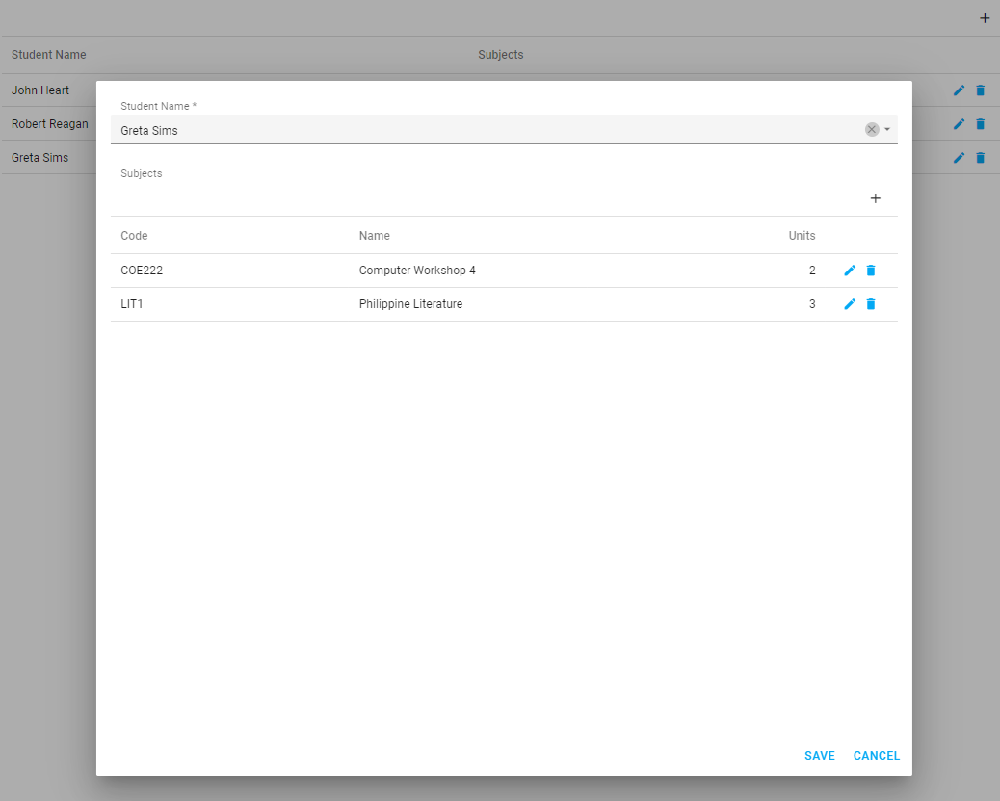

<!-- default badges list -->

<!-- default badges end -->
# DataGrid for DevExtreme - How to define DataGrid in the Popup Edit Form to edit a data field 

This example illustrates how to show DataGrid in the Popup Edit Form and implement CRUD operations for a data field that contains an array.

## Files to Review

- **Angular**
    - [app.component.html](Angular/src/app/app.component.html)
    - [app.component.ts](Angular/src/app/app.component.ts)
- **jQuery**
    - [index.js](jQuery/src/index.js)
- **React**
    - [App.js](React/src/App.js)
- **Vue**
    - [App.vue](Vue/src/App.vue)
- **ASP.Net Core**    
    - [Index.cshtml](ASP.NET/MyApplication/Views/Home/Index.cshtml)

## Documentation

- [Getting Started with DataGrid](https://js.devexpress.com/Documentation/Guide/UI_Components/DataGrid/Getting_Started_with_DataGrid/)

- [DataGrid - API Reference](https://js.devexpress.com/Documentation/ApiReference/UI_Components/dxDataGrid/)

- [Popup - API Reference](https://js.devexpress.com/Documentation/ApiReference/UI_Components/dxPopup/)

- [Form - API Reference](https://js.devexpress.com/Documentation/ApiReference/UI_Components/dxForm/)
<!-- feedback -->
## Does this example address your development requirements/objectives?

 

(you will be redirected to DevExpress.com to submit your response)
<!-- feedback end -->
